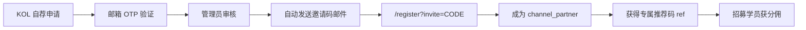

# KOL 邀请码吸引策略（2026-06-17）

基于 [KOL-collaboration skill](https://skills.sh/vivy-yi/xiaohongshu-skills/kol-collaboration) 框架，结合交易豹（Tradelovin）产品现状制定的 KOL 招募与邀请码运营策略。

## 产品定位与 KOL 合作类型

交易豹是 A 股模拟交易训练平台，KOL 合作属于 **Affiliate Partners（佣金合作）** 模式：

- KOL 通过专属推荐链接/码邀请学员注册并付费
- KOL 获得学员学费 **20% 分佣**（符合 skill 建议的 10–30% affiliate 区间）
- 无需预付 flat fee，降低招募门槛，适合早期增长

## 邀请码全流程（已实现）



### 关键触点

| 阶段 | 动作 | 负责人 |
|------|------|--------|
| 获客 | KOL 在 `/partner-dashboard` 自荐（无需登录） | 产品 |
| 验证 | 邮箱 OTP 确认真实性 | 系统自动 |
| 审核 | 管理员在后台查看平台账号（非链接） | 运营 |
| 激活 | 审核通过 → 邮件发送邀请码 + 注册链接 | 系统自动 |
| 转化 | KOL 注册后获得推荐码，招募学员 | KOL |

## 分层招募策略

参考 skill 的 tier 配比，建议初期目标结构：

| 层级 | 粉丝量 | 占比目标 | 特点 | 招募方式 |
|------|--------|----------|------|----------|
| Micro | 1k–10k | **60%** | 互动率 10–20%，转化率高 | 自荐入口 + 小红书/抖音私信 |
| Mid-tier | 10k–100k | **30%** | 覆盖面 + 可信度平衡 | 定向邀请码邮件 |
| Macro | 100k+ | **10%** | 品牌曝光，转化难量化 | 个案洽谈 |

**优先 micro 的原因**：A 股交易教育属垂直 niche，micro KOL 粉丝信任度高，CPA 通常低于 macro。

## 佣金激励设计

### 基础分佣（已上线）

- 学员首笔付费学费的 **20%** 归 KOL
- 通过 `commission_records` + `commission_payouts` 月结

### 建议阶梯奖励（待产品迭代）

| 里程碑 | 奖励 | 目的 |
|--------|------|------|
| 首 10 名付费学员 | 额外 ¥500 奖金 | 激励冷启动 |
| 月引入 ≥20 人 | 分佣提升至 22%（当月） | 鼓励持续推广 |
| 连续 3 月活跃 | 升级为 Brand Ambassador | 长期绑定 |

## 外联话术模板

### 自荐通过后邮件（系统自动）

已内置于 `approve` API：邀请码 + `/register?invite=CODE` 链接 + 20% 分佣说明。

### 主动招募私信（运营手动，参考 skill outreach）

```
Hi @{kolName}，

关注你在 {platform} 上关于投资理财/交易的内容，很有共鸣。

我们是交易豹——专注 A 股模拟交易训练的平台。
学员通过模拟盘练手、学策略，零风险入门。

诚邀成为渠道合作伙伴：
· 你的粉丝通过你的专属链接注册并付费
· 你可获得学费 20% 分成
· 无需囤货、无需客服，平台全包

感兴趣可在此自荐：https://tradelovin.com/partner-dashboard
（填写邮箱 + 社交账号即可，无需先注册）

期待合作！
```

### 学员转化文案（KOL 使用）

复用现有 `src/lib/marketing/templates/student-convert-email.ts` 与 `kol-recruit-email.ts`，由 KOL 在营销文案生成页填写 `{referralLink}`、`{refCode}` 后复制发送。

## 邀请码分发渠道

1. **自荐审核通过** → 系统自动邮件（主渠道）
2. **管理员手动生成** → `/cjkzt/channel-partners` 生成邀请码 + 二维码，用于定向邀约
3. **线下/社群** → 复制邀请链接 `https://tradelovin.com/register?invite=CODE`

## 效果追踪指标

利用现有数据表：

| 指标 | 数据来源 | 目标（首 3 月） |
|------|----------|-----------------|
| 自荐申请数 | `kol_applications` | 月均 50+ |
| 审核通过率 | approved / pending_review | 30–40% |
| 邀请码激活率 | `kol_invite_codes.used_by` / 已发码 | ≥60% |
| KOL 引入学员数 | `referrals` WHERE `partner_id` IS NOT NULL | 每 KOL 月均 3+ |
| CPA | 分佣支出 / 新增付费学员 | < 学费 25% |
| ROAS | 学费收入 / 分佣支出 | ≥3.0 |

### 周报 SQL 示例（管理员）

```sql
-- 本周新增自荐申请
SELECT COUNT(*) FROM kol_applications
WHERE created_at >= NOW() - INTERVAL '7 days';

-- 各 KOL 本月引入学员
SELECT cp.channel_name, COUNT(r.id) AS students
FROM channel_partners cp
JOIN referrals r ON r.partner_id = cp.id
WHERE r.created_at >= date_trunc('month', NOW())
GROUP BY cp.id, cp.channel_name
ORDER BY students DESC;
```

## 长期关系：Ambassador 模式

对连续 3 月月引入 ≥10 付费学员的 KOL，可升级为 **Brand Ambassador**：

- 固定月度 retainer（如 ¥2,000–5,000，按 skill mid-tier 参考）
- 保留 20% 分佣 + 绩效奖金
- 优先体验新课程、联合内容（直播/专栏）
- 在官网/课程页展示 KOL 背书

合同要点参考 skill：scope、compensation、exclusivity（金融教育类目 3 个月）、ad disclosure（#合作）。

## 常见陷阱（来自 skill Common Mistakes）

| 陷阱 | 应对 |
|------|------|
| 只看粉丝数招人 | 审核时看互动质量 + 内容垂直度 |
| 邀请码发了没人注册 | 邮件含清晰 CTA + 30 天有效期提醒 |
| 一次性合作 | 月结 + 阶梯奖励培养长期关系 |
| 不追踪 ROI | 每周看 `referrals` + `commission_records` |

## 下一步行动清单

- [ ] 生产环境执行迁移 `20260617200000_kol_self_application.sql`
- [ ] 确认 `RESEND_API_KEY` / `ADMIN_JWT_SECRET` 已配置
- [ ] 运营在小红书/抖音用自荐链接冷启动 10 位 micro KOL
- [ ] 首月复盘：通过率、激活率、首单转化
- [ ] 迭代阶梯奖励（产品 backlog）
