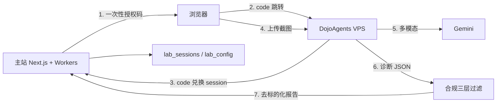

# AI 研究实验室（/lab）Design Spec

**Status:** Approved (CEO) · 2026-07-24  
**Product:** 豹仔学堂 · Leo Learns to Trade  
**Canonical domain (planned):** `leolearnstotrade.com`（`tradelovin.com` 保留跳转；本 spec 不覆盖切域工程）

---

## 1. Problem

豹仔学堂已有 T0 训练盘（执行练习 + TQ），缺少「练研究 / 练归因」的独立入口。学员无法在合规边界内完成「上传持仓截图 → 看懂风险结构」的教学实验。

## 2. Goals

1. 新增独立产品线 **AI 研究实验室**，与 T0 训练盘并列、一脉相承。
2. MVP：**组合诊断**（上传持仓截图 → 多模态识别 → 风险结构 + 教学解读）。
3. 全程 **不荐股、无实盘**；用户可见报告 **去标的化**（不展示股票代码/名称/买卖指令）。
4. T2+ 会员准入；账号经主站 SSO 免登进入实验室。
5. 后台可切换模型提供商（默认 Gemini；未来可启用 GLM）；密钥不进主站/数据库。

## 3. Non-Goals (MVP)

- 研究复盘（事件/新闻拆解）→ P1  
- 教学组合跟踪 → P2  
- 策略回测引擎、实盘、自动拉取 T0 sim 持仓  
- 整站品牌更名 / 主域迁移（另案）

## 4. Product Narrative (global + dual entry)

**展开版：**

> 豹仔学堂是交易训练和量化投资实验的学习平台。我们提供基础课程（线上）与高阶导师亲授课程（线下），并以执行练习（T0 训练盘）和量化投研实验（AI 实验室）两条训练入口，帮你练手感、练纪律、练研究框架。平台不荐股、不代操、无实盘证券交易；所有模拟数据与案例仅供学习训练。

**入口 A · T0 训练盘：** 执行练习（下单、纪律、挑战、TQ）。  
**入口 B · AI 实验室：** 量化投研实验（组合诊断等）。  
两入口首屏均展示「做什么 / 不做什么」与互跳链接。

## 5. Architecture

### 5.1 Components

| Unit | Responsibility |
|------|----------------|
| 主站 `/lab` 入口 | 叙事、会员门禁、历史诊断列表、「进入实验室」 |
| 主站 SSO | 签发一次性授权码；Dojo 服务端兑换短期 session JWT |
| 主站合规过滤器 | Schema + 规则 + 可选语义审核；拦截/改写为去标的化报告 |
| 主站 `lab_sessions` | 审计与成本；RLS 限本人 |
| 主站 `lab_config` | 非敏感：active provider/model；无 API Key |
| 后台 Lab 配置 | 切换 Gemini/GLM；仅显示健康检查通过的选项 |
| DojoAgents (VPS) | 截图上传 UI、多模态调用、教学化 prompt、回调主站 |

### 5.2 SSO (authorization-code)

**不把长期 JWT 放在 URL。**

1. 学员点「进入实验室」→ 主站校验 `lab_access`（T2+ active）。
2. 主站生成 **一次性、≤60s** 的 `auth_code`，存 Redis/DB 或签名 JWT（`jti` + 单次消费）。
3. 浏览器 302 到 Dojo：`https://lab.…/sso/callback?code=…`（无 access token）。
4. Dojo **服务端** `POST /api/lab/sso/exchange` 兑换 session JWT；设 HttpOnly cookie。
5. 诊断回调主站时带服务端密钥或 session 断言。

### 5.3 Compliance (three layers)

1. **Structured output schema**：强制字段为行业暴露、集中度、风险主题、教学问题；禁止 `symbols`/`tickers`/`buy`/`sell` 列表出现在用户报告。  
2. **System prompt**：教学用途；内部识别可用标的，用户报告必须去标的化。  
3. **Post-filter**：规则（指令词、明显代码模式）+ 失败则拦截并要求重写；人工抽检。

**内部识别 vs 用户展示：**

- 内部（Dojo 工作内存）：可含标的以完成诊断。  
- 用户展示 + `lab_sessions.output_json`：仅去标的化教学报告。

### 5.4 Model switching

- 默认：`gemini`（具体 model id 由 Spike 锁定）。  
- 预留：`glm`；仅当 VPS 已配置密钥且健康检查确认 **支持图片输入** 时，后台可选。  
- API Key **仅**在 VPS 环境变量/秘密管理；不写 Supabase、不回传主站 UI。  
- 切换只影响**新建**诊断；历史 `lab_sessions.model` 保留实际模型。

## 6. Data model

### `lab_sessions`

| Column | Type | Notes |
|--------|------|-------|
| id | uuid PK | |
| user_id | uuid | auth.users |
| session_type | text | `'diagnose'` |
| input_summary | text | 无截图本体；如「已上传 1 张截图」 |
| output_json | jsonb | 去标的化报告 |
| model | text | e.g. `gemini-2.0-flash` |
| provider | text | `gemini` \| `glm` |
| tokens | int | nullable |
| cost_cents | int | nullable |
| created_at | timestamptz | |

RLS: `user_id = auth.uid()`；服务角色可写回调。

### `lab_config`

| Column | Type | Notes |
|--------|------|-------|
| key | text PK | e.g. `active_model` |
| value | jsonb | `{ "provider": "gemini", "model_id": "…" }` |
| updated_at | timestamptz | |
| updated_by | uuid | admin |

No secrets.

## 7. Membership

- New capability: `lab_access`  
- Allowed when plan is **T2 or T3** and status **active**（对齐 `requireMembershipCapability` 模式）。  
- T1 及以下：入口展示升级 CTA，API 返回 403。

## 8. Spike Gate (must pass before P0-A)

1. DojoAgents 自托管可运行；锁定版本号。  
2. Gemini 多模态：截图识别准确率可接受；单次成本可估。  
3. 可强制输出我们定义的去标的化 JSON。  
4. 可插入 SSO（auth code exchange）与审计回调。  
5. （可选）GLM 视觉健康检查接口骨架。

**任一硬条件失败 → 切换「自研轻量诊断服务 + Gemini」，不深改 Dojo。**

## 9. Delivery phases

| Phase | Scope |
|-------|--------|
| Spike | Gate 验证 + 决策记录 |
| P0-A | 截图诊断端到端（SSO、合规、sessions） |
| P0-B | 后台模型切换、限次、成本字段、管理导航 |
| P1 | 研究复盘 |
| P2 | 教学组合跟踪 |

## 10. Acceptance (P0)

- [ ] T2+ 一键进实验室并免登（auth-code SSO）  
- [ ] 上传截图返回结构化去标的化诊断  
- [ ] 合规抽检：用户可见输出 0 个股代码 / 买卖指令  
- [ ] `lab_sessions` 含 model / provider / tokens / cost  
- [ ] T1 及以下被拦截  
- [ ] 后台仅可切换至健康检查通过的 provider  

## 11. Open risks

- Gemini 图片与数据处理区域政策 → UI 明示同意。  
- DojoAgents 上游变更 → 锁定版本。  
- 正则 alone 不足 → 必须三层合规。  
- DeepSeek 官方 API 无原生图输入 → 不用作截图识别；不列入默认路径。
