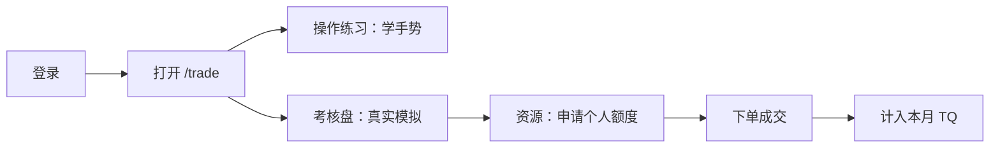
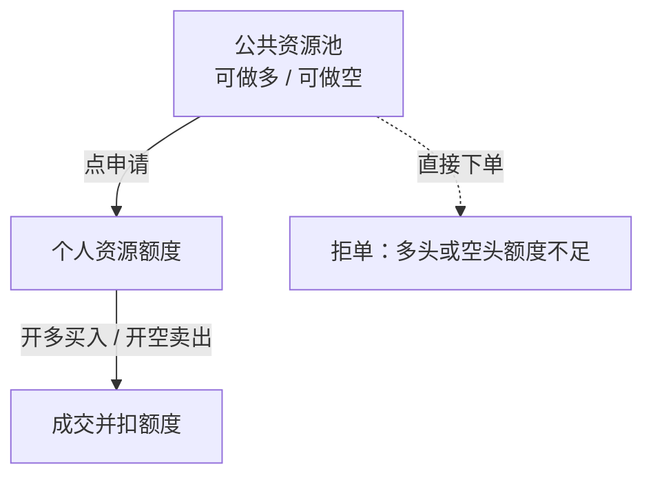

# T0 模拟交易与考核说明书

**适用对象：** 测试员、学员（P0 · 花豹及以后）  
**入口：** 网站顶部「TO交易训练」，或直接打开 `/trade`  
**版本日期：** 2026-08-20

本文说明考核盘怎么用。文字尽量短，步骤写全。

---

## 1. 先分清两件事

| | 操作练习 | 考核盘（本页） |
|---|---|---|
| 入口 | 右上角橙色「操作练习」 | 打开 `/trade` 后整页就是 |
| 扣额度 | 不扣 | 要先申请个人额度 |
| 计入考核 | 不计入 | 成交计入 TQ 月度分 |
| 适合 | 第一次学按钮在哪 | 真实模拟下单、升级评分 |

**考核不在单独菜单里。** 你现在看到的「考核盘（模拟）」就是考核环境。

---

## 2. 第一次打开考核盘

1. 登录账号。
2. 点导航「TO交易训练」，进入 `/trade`。
3. 确认顶栏标题是 **考核盘（模拟）**。
4. 看一眼本月 TQ：成交笔数 / 分数 / 下一档门槛。
5. 第一次会弹出「交易操作指引」。看完再关。右上角「帮助」可再打开。

建议顺序：先点一次「操作练习」走完「资源申请」关，再回到本页做考核。

---

## 3. 最关键：额度

公共池里有很多股，**不等于你能下单**。  
必须先把额度申到「个人资源额度」，开仓才会成功。

### 申请额度（逐步）

1. 顶部「标的代码」输入 `600000` 或 `600000.SH`，按回车。等行情出现。
2. 下单区「股数」填要申请的数量，例如 `1000`（一般是 100 的整数倍）。
3. 滚到「资源」面板，确认「当前申请」显示 `600000.SH × 1000`。
4. 做多：点 **申请多头额度**。做空：点 **申请空头额度**。
5. 看到成功提示后，「个人资源额度」表应出现该标的。
6. 这时才能按同一方向下单。

未选标的时，申请按钮是灰的。先选代码再申请。

---

## 4. 做多：买入开仓，再卖出平仓

1. 「交易模式」选 **做多**。
2. 确认该标的 **多头个人额度 ≥ 下单股数**。
3. 点盘口卖价填价格，或手填大于 0 的价格。
4. 点 **买入**。
5. 到「委托」看结果：
   - 已成交：到「仓位」应有多头。
   - 已挂单：等成交，或改成更接近现价再下。
   - 已拒单：看「解释」列，按「下一步」做。
6. 平多：仍用做多模式，点 **卖出**，数量不超过仓位「可用」。

---

## 5. 做空：卖出开空，再买入回补

1. 「交易模式」选 **做空（卖出开仓/买入回补）**。
2. 确认该标的 **空头个人额度 ≥ 下单股数**。
3. 填价格与数量。
4. 点 **卖出开空**（不是做多里的卖出）。
5. 成交后「仓位」出现空头。
6. 回补：保持做空模式，点 **买入回补**，数量不超过空头可用。

若提示「空头额度不足」：回到第 3 节先申请空头额度，再开空。

---

## 6. 看结果与评分

- **委托**：当日订单。拒单可点「去申请额度」。
- **仓位**：当前持仓。可用为 0 时不能平。
- **成交**：计入 TQ 的记录。
- 顶栏 TQ：满约 10 笔才出有效分。P0 升 T1 门槛约 60 分。完整进度在「会员中心」。

操作练习的成交 **不会** 写进考核委托，也 **不会** 扣个人额度。

---

## 7. 失败时怎么办

每次失败弹窗都有两行：**原因** + **下一步**。  
委托「解释」列同样写全。按提示改，不要反复盲点。

常见情况：

| 你看到 | 先做什么 |
|---|---|
| 空头/多头额度不足 | 选标的 → 资源 → 申请对应额度 → 再下单 |
| 请先输入标的 | 顶部输入代码并回车 |
| 价格必须大于 0 | 点盘口价格，或手填价格 |
| 资金不足 | 打开「账户」，减少数量或先平仓 |
| 无可卖仓位 | 先买入开多并成交 |
| 已挂单 | 等成交，或把价格改近现价 |
| 撮合通道拥堵 | 模拟风控随机拦截，稍后再试 |

---

## 8. 测试遇到问题：点「测试反馈」

顶栏橙色 **测试反馈**，或右下角大按钮 **测试遇到问题？点此反馈**。

1. 用自己的话写：刚才点了什么、期望什么、实际看到什么。
2. 可填微信 / 邮箱 / 手机。
3. 可上传截图。
4. 下面「自动诊断信息」请勿删，系统会带上标的、额度、最近拒单和失败提示。
5. 提交。

---

## 9. 建议测试路径（约 10 分钟）

1. 打开 `/trade`，看到「考核盘（模拟）」和 TQ。
2. 不申请额度，做空下单 → 应被拦住并跳到资源。
3. 输入 `600000`，数量 `1000`，申请空头额度 → 个人表出现记录。
4. 再开空 → 不应再因额度被拒。
5. 点「测试反馈」，确认诊断里有标的和最近失败。
6. 可选：走一遍操作练习，确认不产生真实委托。

---

## 10. 界面对照

考核盘顶栏从左到右大致是：

**考核盘（模拟）** → TQ 进度 → **操作练习** → **测试反馈** → 帮助 / 监控 / 条件单

工作台导航：标的输入、交易设置、行情、下单、委托、仓位、成交、资源、设置、账户、监控总览。

资源页两张表：左边公共池（可申请库存），右边个人额度（真正能用来开仓的数量）。
