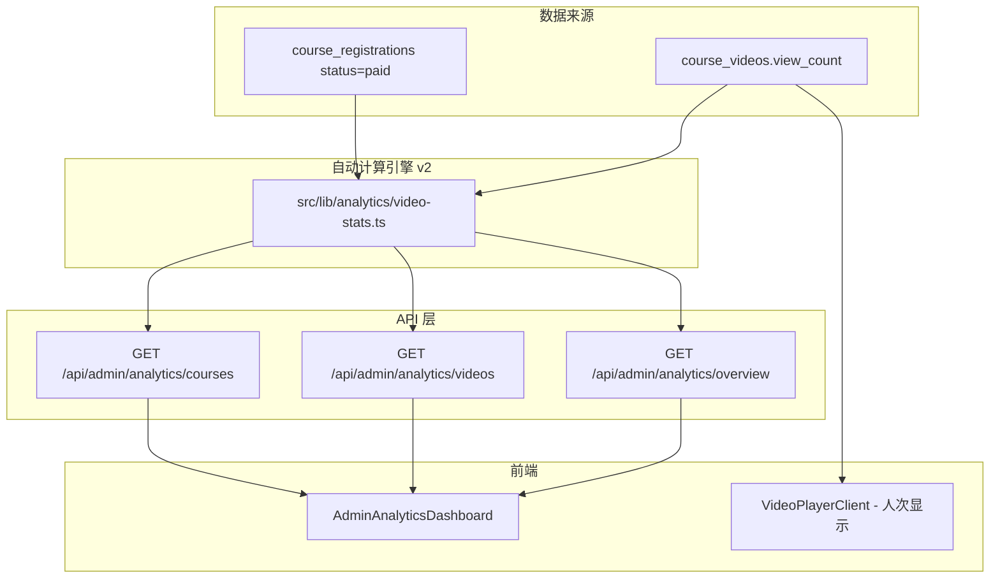

# 视频统计数据系统 — v2 动态日增模型

## 架构概览



## 动态日增模型 v2

### 两段式算法

**段1 — 历史固定数据（2026年3月-6月22日）：**
| 月份 | 当月新增 | 说明 |
|------|---------|------|
| 3月 | 200 | 基准月 |
| 4月 | 200 | 持平 |
| 5月 | 250 | +25% |
| 6月1-22日 | 230 | 桥接期 |

**段2 — 动态模型（2026年6月23日起）：**

```
基础日增量 BASE_DAILY = 10 人次/天
每日复合增长率 DAILY_GROWTH = 1.03 (3%)

第 n 天日增: d[n] = round(10 * 1.03^n)

示例轨迹:
  Day 0 (6/23): 10
  Day 1 (6/24): 10  (10*1.03 = 10.3 → 10)
  Day 2 (6/25): 11  (10.3*1.03 = 10.6 → 11)
  Day 5 (6/28): 12
  Day 10 (7/3): 13
  Day 20 (7/13): 18
  Day 30 (7/23): 24

累计: Day 0 → Day 30 约 500 新增人次
```

**游客 = 会员 × (9~12 倍动态正弦波动)**
**种子 view_count(5000-9999) = 历史数据，不参与新周期拆解**
**totalViews = 种子数据 + 新周期会员 + 新周期游客（同步显示游客量）**

### 四个核心指标

| 指标 | 计算方式 |
|------|---------|
| 会员本月增长量 | 历史段固定值 + 动态模型至今累计 |
| 会员上月增长量 | 历史段固定值 |
| 游客浏览量 | 累计会员 * 10 |
| 录播买课会员人数 | DB 查询（兜底模拟 12） |

## 实现步骤

### 1. 自动计算引擎 `src/lib/analytics/video-stats.ts`
- 动态日增模型：等比数列求和 + 日粒度 partial 计算
- 未来 30 天趋势预测 `getNext30DaysTrend()`
- 视频按 view_count 占比分配新周期数据

### 2. API 端点
- `src/app/api/admin/analytics/overview/route.ts` — 包含 trend 预测
- `src/app/api/admin/analytics/videos/route.ts` — 视频列表
- `src/app/api/admin/analytics/courses/route.ts` — 课程列表

### 3. 认证体系
- `AdminRole` 增加 `"analytics"`
- admin-api-guard、magic-link、layout 全部支持 analytics
- AdminShell 侧边栏新增「视频分析」

### 4. 统计仪表盘
- `AdminAnalyticsDashboard` — 核心指标卡片 + 未来30天趋势预测图 + 课程/视频下钻
- 遵循 DESIGN.md 暗色主题

### 5. 视频播放器
- `VideoPlayerClient` 使用 `formatViewCount()` 格式化显示

### 6. 数据库迁移
- `supabase/migrations/20260623000000_analytics_role.sql` — 扩展 admin_role ENUM
